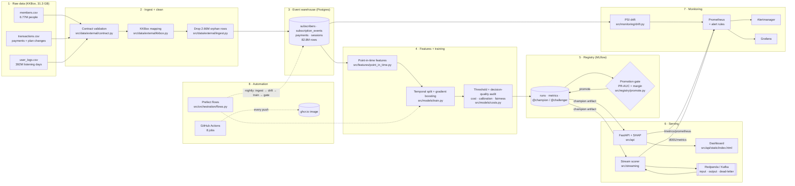

# Architecture

One picture of the whole system, then one table that says, for every box, **what it is,
where it lives in the code, and why it is there**. The "why" column is the one a viva
examiner will ask about.

## What each box is, and why it exists

| # | Component | Where | Why it is built this way |
|---|---|---|---|
| 1 | **KKBox data** | `data/kkbox/` (not in git, 31.3 GB) | A real, public subscription dataset. Synthetic data proves the code runs; real data proves the *decisions* were right. It changed the headline result (see PR-AUC below). |
| 2 | **Contract + mapping** | `src/data/external/` | Real exports are messy. The contract checks columns, types and ranges before anything is written, so a bad file fails in minutes, not three hours into a load. |
| 2 | **Orphan removal** | `ingest.py: drop_orphan_events` | 432,623 subscribers in the transaction log don't exist in the members file. They were **dropped rather than invented**: backfilling a signup date would have made long-standing customers look new, and the model reads "new" as risky. |
| 3 | **Event warehouse** | `src/warehouse/schema.py` | Stores *events with timestamps*, never pre-summed totals. That's what makes it possible to ask "what did this subscriber look like on 1 Nov 2016?" without seeing the future. |
| 3 | **Postgres** | `docker-compose.yml`, `src/warehouse/to_postgres.py` | A real database server, the same one the compose stack uses. SQLite stays as the zero-setup local fallback; one setting (`SDD_DATABASE_URL`) switches between them, and CI tests both. |
| 4 | **Point-in-time features** | `src/features/point_in_time.py` | Features use only the 30 days *before* a cutoff date; the label is whether they churn in the 30 days *after*. The two windows never overlap, so the model can't cheat by seeing the answer. |
| 4 | **Temporal split** | `src/models/train.py` | Train on Nov–Dec 2016, validate on 31 Dec, test on 29 Jan 2017. A random split would leak future behaviour into training and overstate accuracy. |
| 4 | **Threshold + cost audit** | `src/models/train.py`, `src/models/costs.py` | The served threshold (0.05) is the one with the best F1 on validation, and it sits at the bottom of the search grid. A separate **cost audit** prices every mistake (placeholder costs: a missed churner £240, an offer £20 that works 30% of the time) and finds the cost-optimal threshold is **0.43**, about £16.5k cheaper on the test set, because at a 1.5% churn rate almost nobody is risky enough to be worth an offer. The audit *reports*; it does not silently change the threshold. Which one to run is a business decision that depends on real costs. |
| 5 | **MLflow registry** | `src/registry/` | Every training run is recorded with its parameters and metrics. The live model is whichever version holds the `@champion` alias, so "which model is running?" has a single answer. |
| 5 | **Promotion gate** | `src/registry/promote.py` | A new model only replaces the champion if it beats it on **PR-AUC by a margin**. Not ROC-AUC: on KKBox, ROC-AUC went *up* (0.674 → 0.835) while PR-AUC went *down* (0.345 → 0.073) as churn became rarer. ROC-AUC would have hidden the drop. |
| 6 | **API + SHAP** | `src/api/` | Every prediction comes with its reasons: SHAP values that add up exactly to the prediction, so the explanation can't disagree with the score. |
| 6 | **Shadow scoring** | `src/api/service.py` | A challenger model scores live traffic silently beside the champion, so it can be judged on real requests before it's allowed to answer any. |
| 6 | **Streaming** | `src/streaming/`, Redpanda | Scores events as they arrive. Malformed messages go to a **dead-letter topic** instead of crashing the consumer or being lost. |
| 7 | **Prometheus + Alertmanager + Grafana** | `deploy/` | Metrics, 15 alert rules (model not loaded, API down, significant drift, stale pipeline, fairness disparity, stream scorer down, shadow challenger erroring, …), and one dashboard. Alert receivers ship with **no credentials**, and a test fails the build if any appear. |
| 7 | **PSI drift** | `src/monitoring/drift.py` | Compares each feature's live distribution against its training distribution. PSI > 0.25 is significant drift: a sign the model may be going stale. |
| 8 | **Prefect** | `src/orchestration/flows.py` | The nightly pipeline: ingest → check drift → retrain → gate → report. Drift is checked *before* retraining, because afterwards it would compare data with itself and always say "stable". |
| 8 | **CI/CD** | `.github/workflows/ci.yml` | Lint and tests; training on SQLite *and* Postgres; the pipeline proven idempotent; an identical challenger rejected; injected drift detected; the streaming loop with poison messages; the image built and smoke-tested, then **published to ghcr.io** on every merge to `main`. |
| 8 | **Kubernetes** | `deploy/kubernetes/` | Manifests for the API and scorer, the step after compose. CI deploys the API's to a throwaway `kind` cluster on every push. Not deployed to a cloud cluster (no free tier fits a 15 GB warehouse); this is stated, not hidden. |

## Numbers worth knowing by heart

| | |
|---|---|
| Raw data | 31.3 GB of CSV |
| Warehouse | 82.8M rows: 6.77M subscribers, 18.9M events, 18.9M payments, 38.2M sessions |
| Cleaning | 2,656,043 orphan rows dropped (432,623 unknown subscribers, 18.3%) |
| Training rows | 66,704 train · 33,600 validation · 33,042 test |
| Churn base rate | about 1.5% (why accuracy is useless here: "nobody churns" is 98.5% accurate) |
| Decision threshold | 0.05 (best F1 on validation). The cost audit recommends 0.43 under placeholder costs |
| Model | Gradient boosting, 300 trees, depth 3 |
| Test PR-AUC | 0.073, against a 0.015 random baseline: about 4.8× better than guessing |
| Test ROC-AUC | 0.835 |
| At the 0.05 threshold | recall 16.8% (catches about 1 churner in 6) · precision 7.6% (1 in 13 flagged actually churns: 5× the base rate) |
| Accuracy | 95.6%, which is *worse* than predicting "nobody churns" (98.5%). That's why accuracy is never used here |
| Calibration | expected calibration error 0.004: a predicted 5% really means about 5% |
| Fairness audit | **fails** on plan type: the model is near-random for the `standard` plan (ROC-AUC 0.54, only 949 subscribers). Reported, not hidden |
